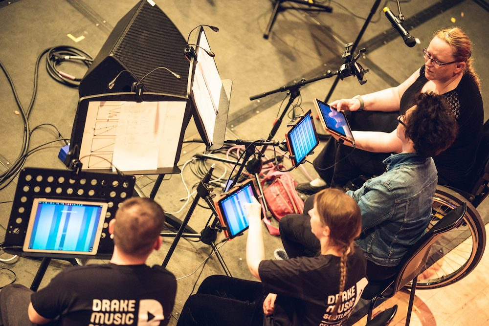

# Creative Computing Experience Day 2023

If you have any questions or comments after today, please feel free to email me at <matt.bellingham@port.ac.uk>

----

> This hands-on session, run by academic staff from the Creative Computing team, will ask you to design a computational solution to a real-world creative problem. Working together, we will review various approaches using both hardware and software before finalising a simple functional prototype. We are aware that applicants have diverse backgrounds and prior knowledge; no experience with specific platforms or languages is necessary, and templates and examples will be provided.

----

# Scenario
Create a device which mimics a vinyl 'scratch' sound, for performance with a mouse, mousepad, or tablet.




# p5.js

<https://p5js.org/>

<https://editor.p5js.org/>

# Finding and loading a suitable sound
You will want to consider whether we need a one-shot / momentary sound (short, occasional sounds), a loop, or a full track.

# Loading samples

A [suitable audio file is available here](https://github.com/mattbport/experience-day-2023/raw/main/assets/amen.wav).


Loading samples is done via [loadSound](https://p5js.org/reference/#/p5/loadSound).

```javascript
function preload() {
  soundFormats('mp3', 'ogg');
  let mySound = loadSound('chirp.mp3');
}
```

If you want to add more than one sample it can be useful to declare the variables using `let`, then populate them.

```javascript
let track1, track2;
function preload() {
  track1 = loadSound("tune.wav");
  track2 = loadSound('anothertune.wav');
}
```

# Create a canvas
We can use [createCanvas](https://p5js.org/reference/#/p5/createCanvas) to make a clickable area. Feel free to change any of these parameters if you wish.

[mousePressed](https://p5js.org/reference/#/p5.Element/mousePressed) is an example of an **event function** -- there are [several of these, documented here](https://p5js.org/reference/#group-Events). If you create a function called `mousePressed` it will get called every time someone presses the mouse. In the example below it will run a function called `canvasPressed`, so we need to create that next.

```javascript
function setup() {
  let cnv = createCanvas(400, 400);
  cnv.mousePressed(canvasPressed);
  background(200);
  text('PRESS', 150, 200);
}
```

# Playback
Finally, we can use [p5.SoundFile](https://p5js.org/reference/#/p5.SoundFile) to play your sample. Here's the full code, and a playable version. [Click here to play](https://editor.p5js.org/mattb/sketches/71G7ieto5).

```javascript
let amen;

function preload(){
  amen = loadSound("amen.wav");
}

function setup() {
  let cnv = createCanvas(400, 400);
  cnv.mousePressed(canvasPressed);
  background(random(255), 125, 125);
  textSize(150);
  textAlign(CENTER);
  fill('white');
  text('Play', 200, 250);
}

function canvasPressed(){
  amen.loop(1);
  amen.stop();
  amen.play();
}
```


# Playback parameters
[p5.SoundFile](https://p5js.org/reference/#/p5.SoundFile) has several methods which allow control over playback. The [full list is here](https://p5js.org/reference/#/p5.SoundFile), with more detail on some key methods linked below.

- [loop](https://p5js.org/reference/#/p5.SoundFile/loop)
- [setVolume](https://p5js.org/reference/#/p5.SoundFile/setVolume)
- [pan](https://p5js.org/reference/#/p5.SoundFile/pan)
- [rate](https://p5js.org/reference/#/p5.SoundFile/rate)
- [reverseBuffer](https://p5js.org/reference/#/p5.SoundFile/reverseBuffer)

Try using some methods to change the playback parameters.

Reversing the buffer:

```js
function canvasPressed(){
  amen.stop();
  amen.reverseBuffer();
  amen.play();
}
```

Speeding up playback to 1.2x:

```js
function canvasPressed(){
  amen.stop();
  amen.rate(1.2);
  amen.play();
}
```

Or, picking a random number and then using it to set the playback rate:

```js
function canvasPressed(){
  let r = random(0.7, 1.3);
  amen.stop();
  amen.rate(r);
  print('Rate is ' +r);
  amen.play();
}
```

The full code will look something like this. [Click here to play](https://editor.p5js.org/mattb/sketches/0PXNeGu6o).

```js
let amen;
function preload(){
  amen = loadSound("amen.wav");
}

function setup() {
  let cnv = createCanvas(400, 400);
  cnv.mousePressed(canvasPressed);
  background(random(255), 125, 125);
  textSize(150);
  textAlign(CENTER);
  fill('white');
  text('Play', 200, 250);
}

function canvasPressed(){
  let r = random(0.7, 1.3);
  amen.stop();
  amen.rate(r);
  print('Rate is ' +r);
  amen.play();
}
```

You can use the `isPlaying` method to only play a file if it is not already playing; this effectively creates a play/pause control.

```js
function playIt() {
  if (!amen.isPlaying()) {
    amen.playMode("restart");
    amen.loop();
    amen.play();
  } else {
    amen.pause();
  }
}
```

# Adding controls

Adding a fader and controlling colours and text:

```js
let amen, ratefader;
function preload(){
  amen = loadSound("amen.wav");
}

function setup() {
  let cnv = createCanvas(400, 400);
  cnv.mousePressed(canvasPressed);
  background(random(255), 125, 125);
  textSize(150);
  textAlign(CENTER);
  fill(125, random(125, 255), 125);
  ratefader = createSlider(0.5, 1.5, 1, 0);
  ratefader.position(130,280);
  text('Play', 200, 250);
}

function canvasPressed(){
  let r = random(0.7, 1.3);
  amen.stop();
  amen.rate(ratefader.value());
  print('Rate is ' +r);
  amen.play();
}
```


# Distance

[dist](https://p5js.org/reference/#/p5/dist) calculate the distance between two points. We can set the *x* and *y* of the target position (in our case, the virtual sound source) and use `dist` to show how far away the mouse pointer is by using `mouseX` and `mouseY`.

# Vectors

```js
createVector(x, y, z)
```

[Vectors](https://p5js.org/reference/#/p5.Vector) can describe a two or three-dimensional vector, specifically a Euclidean (also known as geometric) vector. The datatype stores the components of the vector (x, y for 2D; or x, y, z for 3D). As we are working in 2D we only need to specify the `x` and `y` position. Vectors are useful in many contexts; for now we can replace separate x and y coordinates with a single vector for the target position and the mouse position.

<https://p5js.org/reference/#/p5/createVector>


# Vector distance

We can calculate the distance between two points expressed as vectors. In this example, `t` is a static target position (e.g. the virtual sound source), `m` is the mouse position, and the distance between the two can be calculated by `t.dist(m)` and stored in the variable `d`.

```js
let t, m, d;
t = createVector(300, 300);
m = createVector(mouseX, mouseY);
d = t.dist(m);
```

# Map

Using `map` we can bring in a number and range, and set a new target range. So, if an incoming number is between 0 and 300 we can use map to set a new range of 0 to 1. We can also use `map` to invert a number's range, which is particularly useful in this situation.

Finally, let's put it all together to make a vinyl record! [Click here to play](https://editor.p5js.org/mattb/sketches/tZY5TuB10).

```js
let amen, go, vol;

function preload(){
  amen = loadSound("amen.wav");
}

function setup() {
  createCanvas(400, 400);
  
  // Background colour
  // Random red, fixed green and blue
  background(random(255), 125, 125);
 
  // Array of colours for the label
  let label = ['blue', 'red', 'brown', 'green', 'purple', 'maroon', 'navy'];
  
  // Black vinyl - do you want coloured vinyl?
  fill('black');
  circle(200, 200, 380);
  
  // Create the label and pick one of the colours
  fill(random(label));
  circle(200, 200, 140);
  
  // Add the small hole in the middle
  fill('black');
  circle(200, 200, 10);
  
  // Add text to the label
  textSize(20);
  textAlign(CENTER);
  fill('yellow');
  text('Your name', 200, 180);
  text('Vinyl sim', 200, 235);
  
  // Create a volume control
  vol = createSlider(0, 1, 1, 0);
  vol.style('width', '80px');
  vol.position(310, 375);
  fill('white');
  textSize(15);
  text('volume', 350, 375);
  
  // Add a button for play/stop
  go = createButton("Play/stop");
  go.position(10, 370);
  go.mousePressed(playstop);
}

// Add the play / stop functionality
function playstop(){
  if (!amen.isPlaying()) {
    amen.loop();
    amen.setVolume(vol.value());
    amen.play();
  } else {
    amen.stop();
  }
}

function draw(){
  // Where is the middle of the canvas?
  let middle = createVector(200, 200);
  
  // Where is the mouse?
  let mouse = createVector(mouseX, mouseY);
  
  // How far is the mouse from the middle?
  let d = middle.dist(mouse);
    
  // Convert to values between -1 and 1.5
  let r = map(d, 300, 0, -1, 1.5);
  
  // Use this new value to control playback rate
  amen.rate(r);
}
```

<iframe src="https://editor.p5js.org/mattb/full/tZY5TuB10"></iframe>